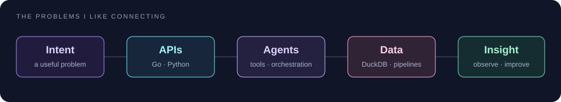

 

<a href="https://anand-bora.vercel.app/">Portfolio ↗</a> &nbsp; · &nbsp;
<a href="https://www.linkedin.com/in/anand-bora/">LinkedIn ↗</a> &nbsp; · &nbsp;
<a href="mailto:anandbora241@gmail.com">Say hello ↗</a>

## 🪐 A little about my orbit

I'm **Anand**, an **AI Engineer at [Flid AI](https://flid.ai/)** in Pune, India. I work where **applied AI, backend engineering, and data systems** meet.

I like the engineering around the model: how an agent uses tools, how data moves through a system, and how to make the whole thing dependable and easy to understand.

- 🧠 **Current focus:** agent architectures and distributed systems.
- ⚡ **Core tools:** Go, DuckDB, and Python.
- 🛠️ **Things I build:** AI integrations, backend services, data pipelines, and cloud tooling.
- 🌱 **What I care about:** clear service boundaries, useful automation, and observability.

 

## ✨ Selected builds

A few corners of my work — from security and ML to the infrastructure underneath.

<table>
<tr>
<td width="50%" valign="top">
<h3>🛡️ SentinelGrid AI</h3>

Exploring AI-powered cyber resilience.

<code>Applied AI</code> <code>Cybersecurity</code> <code>Full stack</code>

<a href="https://github.com/Anand-Bora-0001/SentinelGrid-AI"><b>Explore the project →</b></a>
</td>
<td width="50%" valign="top">
<h3>🍯 HoneyCloud-X</h3>

Honeypot orchestration and SOC intelligence with ML-based threat classification. Co-built with Ganesh Kambli.

<code>FastAPI</code> <code>React</code> <code>Scikit-Learn</code>

<a href="https://github.com/Anand-Bora-0001/HoneyCloud-X"><b>Explore the project →</b></a>
</td>
</tr>
<tr>
<td width="50%" valign="top">
<h3>🧬 Enterprise MLOps Platform</h3>

Model lifecycle, deployment, and production ML workflows.

<code>Python</code> <code>MLOps</code> <code>Docker</code>

<a href="https://github.com/Anand-Bora-0001/Enterprise-MLOps-Platform"><b>Explore the project →</b></a>
</td>
<td width="50%" valign="top">
<h3>🌊 Real-Time Data Engineering</h3>

Streaming data pipelines for real-time processing and analytics.

<code>Data engineering</code> <code>Streaming</code> <code>Cloud</code>

<a href="https://github.com/Anand-Bora-0001/Real-Time-Data-Engineering-Platform"><b>Explore the project →</b></a>
</td>
</tr>
<tr>
<td width="50%" valign="top">
<h3>🛰️ Observability Platform</h3>

Infrastructure monitoring, alerting, and incident-response workflows.

<code>Prometheus</code> <code>Grafana</code> <code>FastAPI</code>

<a href="https://github.com/Anand-Bora-0001/cloud-monitoring-dashboard"><b>Explore the project →</b></a>
</td>
<td width="50%" valign="top">
<h3>🗂️ Enterprise Data Platform</h3>

Data governance, metadata discovery, quality, and analytics.

<code>FastAPI</code> <code>PostgreSQL</code> <code>React</code>

<a href="https://github.com/Anand-Bora-0001/Enterprise-Data-Platform"><b>Explore the project →</b></a>
</td>
</tr>
</table>

<a href="https://github.com/Anand-Bora-0001?tab=repositories"><b>More experiments, tools, and builds ↗</b></a>

## 🎨 My toolbox

<b>At the center of my work</b>

<b>Backend &amp; data</b>

<b>Cloud &amp; delivery</b>

<b>Also in the toolkit: frontend &amp; languages</b>

 

## 🐍 A year of building, one square at a time

<picture>
  <source media="(prefers-color-scheme: dark)" srcset="https://raw.githubusercontent.com/Anand-Bora-0001/Anand-Bora-0001/output/github-contribution-grid-snake-dark.svg" />
  <source media="(prefers-color-scheme: light)" srcset="https://raw.githubusercontent.com/Anand-Bora-0001/Anand-Bora-0001/output/github-contribution-grid-snake.svg" />
  
</picture>

My contribution calendar, with a little personality. Refreshed daily.

<b>📊 More from my GitHub</b>

 

<a href="https://github.com/Anand-Bora-0001?tab=repositories">Browse my repositories</a> · <a href="https://github.com/Anand-Bora-0001?tab=stars">Things I find interesting</a>

<b>⚡ Recent public activity</b>

 

<!--START_SECTION:activity-->
1. 🗣 Commented on [#543](https://github.com/flidai/leapview/pull/543#issuecomment-5587094030) in [flidai/leapview](https://github.com/flidai/leapview)
<!--END_SECTION:activity-->

## 💬 Let's build something useful

I'm interested in collaborating on **AI products, agent tooling, backend systems, and open source**. If you're working on a problem in that space, I'd love to hear about it.

